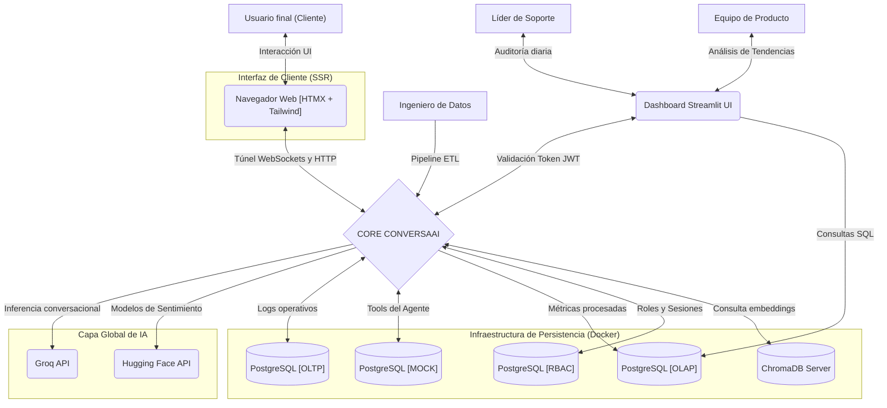

# Especificación de Requisitos de Software de ConversaAI

**Contenido**

**[1 Introducción	2](#introducción)**

[1.1 Propósito	3](#propósito)

[1.2 Alcance	3](#alcance)

[1.3 Definiciones, acrónimos y abreviaturas	3](#definiciones,-acrónimos-y-abreviaturas)

[1.4 Referencias	3](#referencias)

[**2 Descripción general	3**](#descripción-general)

[2.1 Perspectiva del producto	3](#perspectiva-del-producto)

[2.2 Funcionalidad del producto	4](#funcionalidad-del-producto)

[2.3 Características de los usuarios	4](#características-de-los-usuarios)

[2.4 Restricciones	4](#restricciones)

[2.5 Suposiciones y dependencias	4](#suposiciones-y-dependencias)

[**3 Requisitos específicos	5**](#requisitos-específicos)

[3.1 Requisitos funcionales	5](#requisitos-funcionales)

[3.2 Requisitos no funcionales	5](#requisitos-no-funcionales)

[**4 Notas	6**](#notas)

[4.1 Arquitectura Cliente-Servidor mediante API RESTFUL	6](#arquitectura-cliente-servidor-mediante-api-restful)

[4.2 Monolito Modular	7](#monolito-modular)

[4.3 Arquitectura en Capas (Scaffolding)	8](#arquitectura-en-capas-\(scaffolding\))

[4.3.1 Capa de Interfaces y Adaptadores (app/api/)	8](#capa-de-interfaces-y-adaptadores-\(app/api/\))

[4.3.2 Capa de Aplicación y Lógica Modular (app/modules/)	8](#capa-de-aplicación-y-lógica-modular-\(app/modules/\))

[4.3.3 Capa de Dominio y Datos Compartidos (app/common/)	8](#capa-de-dominio-y-datos-compartidos-\(app/common/\))

[4.3.4 Capa de Infraestructura y Configuración (app/core/)	8](#capa-de-infraestructura-y-configuración-\(app/core/\))

# Introducción

## Propósito

   Definir los requisitos técnicos y funcionales para el desarrollo de un Sistema de Observabilidad y Análisis de Conversaciones y su correspondiente Agente Conversacional para ConversaAI. El sistema busca identificar patrones de frustración y abandono en el corpus de mensajes para optimizar los flujos de negocio.

## Alcance

El producto, denominado ConversaAI, actuará como un ecosistema dual:   
 
* **Agente Inteligente:** Chatbot que interactúa con usuarios finales para resolver consultas específicas.  
* **Sistema Evaluador:** Herramienta analítica de métricas y visualización de insights que procesa más de 2 millones de mensajes mensuales en español y portugués.  
  * El soporte regional e idiomático (Español y Portugués) está garantizado por diseño desde la persistencia. En el esquema operativo, cada ticket en *agent_core.sessions* cuenta con la clave foránea language_id vinculada a *cat_languages*. Para el entorno analítico, el pipeline asíncrono normaliza esta variable cargándola en la dimensión conformada *analytics_warehouse.dim_language*, permitiendo el filtrado eficiente en el dashboard regional sin penalizar el rendimiento.

## Definiciones, acrónimos y abreviaturas

## Referencias

* **NLP:** Procesamiento de Lenguaje Natural.    
* **Intent:** Propósito detrás del mensaje del usuario.    
* **Sentiment:** Tono emocional (positivo, negativo, neutral).    
* **LangGraph:** Framework para la gestión de estados y ciclos en conversaciones de IA.  
* **RAG:** Generación Aumentada por Recuperación (RAG, por sus siglas en inglés) es una técnica de inteligencia artificial que mejora la precisión y relevancia de los modelos de lenguaje (LLMs) al permitirles consultar bases de datos o documentos externos específicos y fiables antes de generar una respuesta.

# Descripción general

## Perspectiva del producto

   El sistema es un producto independiente que actúa como una capa de inteligencia de negocios (BI). Se compone de un frontend analítico para operadores (Dashboard en Streamlit) y una interfaz web propia de mensajería para usuarios finales (Web Chat híbrido: modal flotante y pantalla completa), renderizada del lado del servidor (SSR) mediante FastAPI, HTMX y WebSockets.

## Funcionalidad del producto

* **Interacción (Agente):** Gestión de conversaciones mediante grafos de estado y captura de feedback directo (likes/dislikes).    
* **Ingesta de datos:** Carga masiva del corpus de las sesiones finalizadas.    
* **Pipeline de limpieza:** Normalización y remoción de datos sensibles (PII).    
* **Clasificación de IA:** Identificación de intención y sentimiento mediante modelos preentrenados.    
* **Detección de abandono:** Algoritmo para identificar puntos de fuga por frustración.    
* **Visualización:** Dashboard con métricas de intenciones no resueltas.  
* **Memoria episódica a largo plazo (Personalización):** El agente conversacional posee la capacidad de extraer, almacenar y recuperar hechos específicos y preferencias de cada cliente a lo largo del tiempo. Esto permite ofrecer una experiencia de atención hiperpersonalizada, donde el bot recuerda el contexto histórico del usuario en sesiones futuras sin depender de que este repita la información.

## Características de los usuarios

| *Tipo de usuario* | *Formación (nivel educativo)* | *Experiencia y Especialización técnica* |
| :---- | :---- | :---- |
| ***Ingeniero de Datos** (Operador del Pipeline)* | *Universitario completo o en curso avanzado en Ciencia de Datos, Licenciatura en Sistemas de Información, Ingeniería en Computación o carreras afines con fuerte base cuantitativa.* | *Experiencia comprobable en diseño y ejecución de pipelines de datos por lotes (Batch Ingestion) y procesos ETL/ELT. Especialización en manipulación de bases de datos relacionales orientadas al análisis (PostgreSQL en capa OLAP con modelado en estrella). Dominio técnico de entornos contenerizados (Docker y Docker Compose) y ejecución de scripts de backend en Python para activar ingestas masivas sobre el core del sistema.* |
| ***Líder de Soporte** (Auditor Operacional de UX)* | *Terciario o Universitario en Sistemas, Comunicación Digital, Administración de Empresas o certificación equivalente en gestión avanzada de Experiencia del Cliente (Customer Experience \- CX).* | *Experiencia sólida en el monitoreo de KPIs de atención al cliente, gestión de salas de crisis virtuales y auditoría de calidad de flujos conversacionales. Perfil técnico de usuario avanzado: capacidad quirúrgica para operar interfaces de visualización complejas (Dashboard en Streamlit UI), interpretar paneles de análisis de sentimiento en tiempo real y filtrar métricas mediante tags lógicos generados por IA (como detección de desvíos semánticos o bucles recursivos), sin requerir conocimientos de programación.* |
| ***Equipo de Producto** (Consumidor Estratégico)* | *Universitario completo en Ingeniería de Software, Licenciatura en Sistemas, Negocios Digitales o áreas comerciales con especialización formal en Product Management de productos basados en Inteligencia Artificial.* | *Experiencia intermedia/avanzada en el diseño estratégico de árboles de decisión conversacionales, flujos lógicos orientados a grafos de estado y optimización de bases de conocimiento para motores RAG. Capacidad analítica senior para procesar datos agregados históricos e intenciones no resueltas expuestas en la UI, traduciendo métricas de frustración técnica en requerimientos funcionales listos para ser priorizados en el backlog del próximo sprint de desarrollo.* |

## Restricciones

* **Lenguaje:** El backend debe ser desarrollado íntegramente en Python utilizando FastAPI y en el frontend se usará Streamlit.  
* **Arquitectura:** Se implementará un Monolito Modular para facilitar la trazabilidad y reducir la complejidad del despliegue en el MVP.    
* **Infraestructura:** Uso de Groq para la inferencia conversacional en tiempo real, la API de Hugging Face para el enriquecimiento analítico, PostgreSQL organizado en tres esquemas lógicos para la persistencia estructurada, y ChromaDB operando en arquitectura Cliente-Servidor independiente para la persistencia y recuperación de embeddings del RAG.

## Suposiciones y dependencias

  Este sistema está sujeto a factores externos y decisiones tecnológicas de terceros que escapan al control directo del equipo de desarrollo. Si cualquiera de las siguientes suposiciones o dependencias se viera alterada, los requisitos funcionales, no funcionales y de arquitectura de esta ERS deberán ser modificados y reevaluados.

  Suposiciones de Continuidad y Estabilidad del entorno:

1. **Disponibilidad y SLA de APIs de Inferencia Externa (Groq / Hugging Face):** Se asume que los proveedores mantendrán una alta disponibilidad. Sin embargo, para garantizar la tolerancia a fallos ante posibles caídas, timeouts o restricciones de cuota (Rate Limits) del proveedor principal, el sistema implementa un Servicio LLM con lógica de reintentos (Exponential Backoff) y Fallback Circular. Si el modelo principal falla, el sistema rotará automáticamente hacia un modelo o proveedor de respaldo (ej. Llama 3 local u otro proveedor en la nube) para asegurar que el agente nunca interrumpa el servicio al usuario final.  
2. **Compatibilidad de la Plataforma de Persistencia:** Se asume que el entorno de despliegue final (servidor VPS o Base de Datos como Servicio Cloud \- DBaaS) permite la instalación nativa, ejecución y configuración de la extensión "uuid-ossp" en el motor PostgreSQL. Si el proveedor de infraestructura restringiera el uso de esta extensión, los requisitos de identidad y trazabilidad de la ERS deberían modificarse por completo para migrar a identificadores secuenciales convencionales (BIGINT), impactando la seguridad de los esquemas.  
     
   Dependencias críticas de sistemas de terceros:  
     
1. **Dependencias de conectividad y navegador:** El funcionamiento de la Capa de Interfaces (Web Chat) depende de que los clientes web (navegadores) de los usuarios finales soporten conexiones bidireccionales persistentes mediante el protocolo WebSocket (WSS) y permitan la ejecución de la librería HTMX para la inyección dinámica de HTML en el DOM.  
2. **Retrocompatibilidad del Ecosistema de Orquestación de IA:** La máquina de estados conversacional y los mecanismos de persistencia del historial operativo (Checkpointers) dependen del framework de código abierto LangGraph y LangChain. El proyecto asume estabilidad y retrocompatibilidad (Backward Compatibility) en sus librerías. Si una actualización mayor modificara los contratos de herencia de los estados del grafo, el backend del módulo "Agent" debería ser re-especificado.

# Requisitos específicos

## Requisitos funcionales

| *Nº de requisito* | *Descripción del requisito* |
| ----- | ----- |
| ***RF\#01*** | *El agente debe interactuar con los usuarios finales a través de una interfaz Web Chat propia, capaz de renderizar componentes visuales enriquecidos (carruseles, botones) recibidos en tiempo real.* |
| ***RF\#02*** | *El agente debe permitir al usuario calificar respuestas individuales con botones de feedback.* |
| ***RF\#03*** | *El sistema debe utilizar LangGraph para permitir flujos de conversación no lineales.* |
| ***RF\#04*** | *El evaluador debe limpiar el corpus mensual eliminando información personal identificable (PII).* |
| ***RF\#05*** | *El motor de IA debe clasificar cada mensaje por sentimiento (Positivo/Neutral/Negativo) e intención.* |
| ***RF\#06*** | *El sistema debe calcular la tasa de abandono basada en sesiones que no alcanzaron un nodo de resolución.* |
| ***RF\#07*** | *El dashboard debe visualizar las "Top unresolved intents" mediante gráficos interactivos.* |
| ***RF\#10*** | *El Sistema Evaluador no podrá limitarse a una clasificación binaria. Deberá categorizar las sesiones finalizadas por timeout en tres estados: Éxito, Frustración o Neutral, basándose en una heurística que combine la cantidad de mensajes, el último nodo alcanzado en LangGraph y la polaridad del sentimiento.* |
| ***RF\#11*** | *Sesiones con menos de 3 mensajes y sentimiento neutral deberán ser marcadas automáticamente como "Abandono Neutro" para evitar sesgar los reportes de performance del bot.* |
| ***RF\#12*** | *El sistema debe permitir al Líder de Soporte filtrar y agrupar las evaluaciones del dashboard mediante tags de negocio e IA (ej. \[bucle-detectado\]). Restricción Técnica: Este filtrado debe consumir de forma exclusiva la tabla puente analítica analytics_warehouse.fact_tag_assignments conectada a dim_tags, quedando estrictamente prohibido realizar JOINs con la tabla operativa agent_core.session_tags para evitar la degradación del entorno transaccional.* |

## Requisitos no funcionales

| *Nº de requisito* | *Descripción del requisito* | *Clasificación* |
| ----- | ----- | ----- |
| *RNF\#01* | *El tiempo de respuesta del agente (inferencia de Groq) debe ser inferior a 2 segundos.* | *Eficiencia* |
| *RNF\#02* | *El sistema debe ser capaz de procesar el corpus de 2M de mensajes en un máximo de 24hs.* | *Rendimiento* |
| *RNF\#03* | *Todas las trazas de ejecución de los modelos deben registrarse en LangSmith.* | *Observabilidad* |
| *RNF\#04* | *La interfaz de analista (Streamlit) debe ser accesible vía web con autenticación básica.* | *Seguridad* |
| *RNF\#05* | *El sistema utilizará PostgreSQL organizado en tres esquemas lógicos estrictamente separados para mitigar el impacto de los 2 millones de mensajes mensuales: como agent_core que Optimizado para transacciones rápidas (OLTP) con índices en claves operativas (user_id, session_id),  fintech_mock que es Entorno aislado para la simulación de cuentas, tarjetas y movimientos bancarios, analytics_warehouse que es un Modelo analítico en estrella (OLAP) optimizado para lecturas masivas desde Streamlit, con índices específicos en dimensiones conformadas y tablas puente (idx_fact_time, idx_fact_tag_assignment_tag). Los procesos de lectura analítica no deben bloquear bajo ningún concepto las tablas de escritura del agente.* | *Eficiencia* |
| *RNF\#06* | *El almacenamiento y la búsqueda de vectores de conocimiento (RAG) se deben realizar mediante una instancia dedicada de ChromaDB Server, quedando estrictamente prohibido el modo de persistencia en archivo local embebido para evitar colisiones de concurrencia y bloqueos de disco en picos de alta demanda.* | *Eficiencia / Escalabilidad* |
| *RNF\#07* | *El sistema de inferencia debe implementar Exponential Backoff para reintentos de conexión y un Fallback Circular de modelos para garantizar respuestas sin interrupción ante caídas del proveedor principal de IA.* | *Resiliencia* |
| *RNF\#08* | *La evolución y el control de versiones de los tres esquemas lógicos de PostgreSQL (`agent_core`, `fintech_mock`, `analytics_warehouse`) deben gestionarse obligatoriamente de forma automatizada y trazable utilizando **Alembic** para las migraciones.* | *Mantenibilidad* |
| *RNF\#09* | *El backend debe generar Logs Estructurados en formato JSON. Es obligatorio que cada línea de log inyecte el contexto de la ejecución (session_id y user_id) para permitir auditorías precisas sobre el volumen de 2 millones de mensajes.* | *Observabilidad* |
| *RNF\#10* | *Los endpoints expuestos de la API que sirven las plantillas HTML públicas y establecen los túneles de WebSockets deben estar protegidos mediante políticas de Rate Limiting (SlowAPI) para mitigar ataques de Denegación de Servicio (DDoS).* | *Seguridad* |
| *RNF\#11* | *La memoria a largo plazo debe persistirse en una colección dedicada en ChromaDB (user_long_term_memory), estrictamente separada de la base de conocimiento global. Para garantizar la privacidad y evitar la contaminación cruzada (fuga de memoria entre el Usuario A y el Usuario B), es obligatorio que toda inserción y búsqueda de memoria incluya un filtrado duro por metadatos utilizando el identificador único del cliente (user_id).* | *Seguridad / Privacidad* |
| *RNF\#12* | *Para consultas que involucren datos financieros sensibles del esquema fintech_mock, el agente debe implementar un mecanismo de desafío de doble factor (OTP) en el flujo de LangGraph. Se prohíbe el acceso transaccional directo basado únicamente en el identificador del canal.* | *Seguridad / Control de Acceso* |
| *RNF\#13* | *El acceso al Dashboard de Streamlit estará restringido mediante tokens criptográficos JWT emitidos de forma asíncrona por el backend de FastAPI. Los permisos de visualización y ejecución se validarán de forma granular mediante el modelo RBAC del esquema internal_ops.* | *Seguridad / Gobierno de Datos* |

# Notas

## Arquitectura Cliente-Servidor mediante API RESTFUL

   El sistema se fundamenta en un modelo Cliente-Servidor desacoplado a través de una capa de API REST. Esto permite que el backend sea completamente independiente del frontend, lo que facilita la implementación de diversos clientes que pueden interactuar con el backend, como una aplicación móvil desarrollada con React Native, entre otros. Esta elección es estratégica para garantizar la flexibilidad y posible expansión del ecosistema ConversaAI.

* **Utilidad:** Permite que múltiples "clientes" (Interfaz Web Chat, Dashboard de Streamlit) interactúen con un único "cerebro" centralizado. Al utilizar el protocolo HTTP y estándares REST, el servidor puede escalar su lógica interna (como cambiar de un modelo de IA a otro) sin que los clientes sufran interrupciones o requieran cambios en su código.  
* **Intercambio de datos:** Se utiliza JSON como formato de intercambio universal, asegurando que la integración entre el procesamiento de lenguaje natural (NLP) y las interfaces de usuario sea fluida y estándar.

## Monolito Modular

  Un Monolito Modular es un patrón de diseño de software donde el sistema se construye como un artefacto o bloque único de despliegue, pero cuya estructura interna sigue una separación estricta de responsabilidades basada en dominios de negocio. Esta arquitectura permite equilibrar la agilidad de un equipo reducido con la necesidad de un orden técnico escalable.

  Para garantizar la integridad del sistema, se define bajo estos cinco pilares fundamentales:

1. **Estructura de código y aislamiento lógico:** A diferencia de un monolito convencional (donde el código suele estar entrelazado), el sistema se divide en módulos independientes y cohesivos. En el caso de ConversaAI, los dominios están claramente diferenciados en el scaffolding (**app/modules/agent**) y **app/modules/evaluator**). El aislamiento es clave: un módulo no puede acceder directamente a las funciones internas de otro; la comunicación se realiza exclusivamente a través de interfaces públicas o contratos bien definidos (APIs internas), lo que permite que el desarrollo sea paralelo y ordenado.  
2. **Gestión de datos y persistencia**: Aunque físicamente el sistema se conecta a una única instancia de base de datos (PostgreSQL), el diseño exige un aislamiento de datos a nivel lógico. Esto implica que las tablas pertenecientes al módulo del Agente no deben ser consultadas ni modificadas directamente por el código del módulo Evaluador. Cada módulo es "dueño" de su propio esquema o conjunto de tablas, evitando el acoplamiento a nivel de datos y facilitando una posible migración hacia bases de datos independientes en el futuro si el volumen lo requiere.  
3. **Unidad de despliegue (Runtime)**: Desde la perspectiva de operaciones, el sistema es una unidad atómica. Unidad de despliegue (Runtime): Desde la perspectiva de la aplicación, el código de la API y los módulos se empaquetan en una imagen de contenedor atómica (Docker). Sin embargo, la infraestructura completa del sistema está estructurada como un **ecosistema multi-contenedor orquestado mediante Docker Compose**, aislando el runtime de la aplicación, el motor de base de datos relacional (PostgreSQL) y el servidor de base de datos vectorial (ChromaDB Server) en contenedores y redes lógicas independientes para garantizar el aislamiento de recursos y evitar bloqueos por concurrencia. Esto simplifica drásticamente el pipeline de CI/CD, ya que no se requiere la coordinación de múltiples despliegues sincronizados, reduciendo el margen de error en producción.  
4. **Infraestructura y recursos compartidos**: El sistema reside en un único entorno de ejecución compartido. Esto implica una gestión eficiente de la cuota de hardware disponible:  
   1. **CPU y Memoria:** Los hilos de ejecución de los diferentes módulos compiten por el mismo procesador y espacio de RAM, lo que requiere un manejo asíncrono eficiente (mediante FastAPI y **BackgroundTasks**).  
   2. **Latencia de Red:** Es prácticamente nula para la comunicación entre componentes, ya que las llamadas son locales (in-process). Esto elimina la sobrecarga de serialización y los protocolos de red (como HTTP o gRPC) que son obligatorios en las arquitecturas de microservicios, optimizando la velocidad de respuesta del bot.  
5. **Resiliencia y aislamiento de errores:** A pesar de compartir el mismo entorno de ejecución, la arquitectura modular busca minimizar el radio de explosión de fallos. El diseño implementa un manejo de excepciones aislado, de modo que un error crítico o un consumo excesivo de recursos en el procesamiento pesado del Módulo Evaluador (ETL o clasificación de sentimientos) no comprometa la disponibilidad inmediata del Módulo Agente para responder mensajes en la interfaz web de chat.

## Arquitectura en Capas (Scaffolding)

      La organización interna del código sigue un patrón de arquitectura en capas, donde cada nivel tiene una responsabilidad única y limitada. A continuación, se detalla la función de cada capa según la estructura de carpetas implementada:

### Capa de Interfaces y Adaptadores (app/api/)

      Es la puerta de entrada al sistema. Su función es gestionar las conexiones bidireccionales en tiempo real mediante WebSockets y servir las plantillas HTML generadas dinámicamente por el motor Jinja2 (SSR). Es la responsable de traducir los inputs del usuario provenientes de la UI hacia el orquestador del agente . No contiene lógica de negocio, solo se encarga del protocolo de comunicación. **En esta capa se aplican las restricciones de seguridad perimetral, incluyendo el Rate Limiting (SlowAPI) para prevenir la saturación de los endpoints.**

### Capa de Aplicación y Lógica Modular (app/modules/)

      Es el corazón del software. Acá se encuentran los servicios que ejecutan las tareas principales:

* **Módulo Agent:** Orquesta la conversación usando LangGraph y Groq. Además de resolver el enrutamiento híbrido (RAG vs. SQL), este módulo gestiona el ciclo de vida de la Memoria a Largo Plazo del usuario mediante un nodo asíncrono dedicado. Para evitar la saturación de datos y la contradicción de contextos, el módulo implementa una arquitectura de memoria avanzada basada en tres fases lógicas:  
  * **Extracción de entidades (Fact Extraction):** Al finalizar cada interacción, un modelo evalúa la sesión en segundo plano y extrae de forma atómica únicamente los hechos nuevos y permanentes sobre el usuario (ej. preferencias de inversión, quejas recurrentes).  
  * **Actualización semántica (UPSERT):** Antes de persistir un nuevo recuerdo en ChromaDB, el sistema busca similitudes previas bajo el mismo user_id. Si detecta un hecho preexistente que colisiona o se actualiza, ejecuta una operación de sobreescritura (Upsert) pisando el vector antiguo con el nuevo, manteniendo la coherencia y evitando la acumulación de basura vectorial  
  * **Decaimiento por Relevancia (Time-Weighted Decay):** Durante la fase de recuperación (Retrieval), el algoritmo de búsqueda pondera matemáticamente la distancia del vector junto con la fecha de extracción. Esto permite que la memoria mantenga un perfil vivo, priorizando las preferencias recientes sobre las antiguas sin recurrir a borrados destructivos arbitrarios.  
* **Módulo Evaluador:** Orquesta el pipeline de datos asíncrono e independiente. Se encarga de la extracción del corpus conversacional del OLTP, la limpieza del texto, la inferencia remota (vía API de Hugging Face para el modelo pysentimiento), la resolución de la intención del usuario y la inyección consolidada de métricas en la tabla de hechos fact_sessions_evaluation y sus dimensiones asociadas (incluyendo la asignación de etiquetas en la tabla puente fact_tag_assignments).

### Capa de Dominio y Datos Compartidos (app/common/)

     Contiene las definiciones de las entidades que recorren todo el sistema (ej. modelos de base de datos, esquemas de mensajes). Es una capa transversal que asegura que todos los módulos hablen el mismo idioma y utilicen la misma estructura de datos.

### Capa de Infraestructura y Configuración (app/core/)

     Provee las herramientas necesarias para que el sistema funcione: conexiones asíncronas a PostgreSQL, inicialización del cliente HTTP para ChromaDB, configuración de variables de entorno (.env) y clientes de infraestructura para LangSmith o Groq. Adicionalmente, esta capa centraliza la configuración de los Logs Estructurados contextuales, la configuración del control de versiones de la base de datos (Alembic) y el Servicio LLM maestro encargado de la lógica de reintentos y Fallback.

### Estrategia de Autenticación, Autorización y seguridad perimetral

     El sistema ConversaAI implementa políticas de seguridad diferenciadas según el entorno de ejecución (Frontend analítico vs. Interfaz Web Chat de usuario final), garantizando la mitigación del riesgo de suplantación de identidad y accesos no autorizados a información transaccional confidencial.

### Estrategia de Autenticación, Autorización y seguridad perimetral

     Dado que el widget de mensajería web es de acceso público y opera inicialmente mediante sesiones anónimas en el navegador del cliente, el agente de LangGraph maneja de forma nativa variables de estado para el control de accesos lógicos. Ante la solicitud de datos estructurados financieros de la fintech, el sistema evalúa las siguientes alternativas arquitectónicas:

* **Alternativa A \- Identificación pasiva (Soft auth):** Confianza ciega en el ID de sesión temporal generado por el navegador web o la cookie persistente.  
  * **Ventajas:** Fricción nula para el usuario en la experiencia conversacional.  
  * **Desventajas:** Riesgo crítico de seguridad. No verifica la identidad real de la persona física frente a la pantalla. Si la terminal está comprometida (ej. computadora compartida en una oficina o sesión no cerrada), se expone por completo el secreto financiero del cliente a cualquier tercero.  
* **Alternativa B \- Desafío de doble factor asíncrono (Step-up Auth \- SELECCIONADA):** Envío de un código de un solo uso (OTP) generado por la plataforma hacia el correo electrónico o número SMS del cliente previamente registrado en la base de datos relacional.  
  * **Ventajas:** Equilibrio óptimo entre seguridad y usabilidad. Valida la identidad cruzando la sesión del navegador con un dispositivo personal (teléfono/email) sin obligar al usuario a crear ni recordar contraseñas estáticas complejas.  
  *   
  * **Desventajas:** Introduce fricción temporal al requerir que el usuario consulte una bandeja de entrada fuera del flujo de chat inmediato.  
* **Alternativa C \- Deep Linking con Biometría Nativa (Enfoque de aplicación):** Redirección mediante un enlace dinámico hacia la aplicación móvil nativa de la fintech para validar la identidad mediante hardware biométrico (FaceID/Huella), notificando el éxito al backend conversacional.  
  * **Ventajas:** Nivel de seguridad bancario de grado militar.  
  * **Desventajas:** Introduce una enorme fricción (especialmente si el usuario está operando desde una computadora de escritorio), obligándolo a cambiar de dispositivo, lo cual excede el alcance del Producto Mínimo Viable (MVP).

    **Justificación de Selección:** Se adopta la Alternativa B. Esta decisión erradica las vulnerabilidades de la sesión anónima en navegadores, validando la identidad de forma segura e independiente del dispositivo desde donde se inicia el chat web, manteniendo al bot autónomo.

### Autenticación y Gobierno del personal interno (Dashboard Streamlit)

    Para proteger la telemetría conversacional, los logs analíticos y las métricas de frustración contra accesos indebidos de la internet pública, se restringe la UI del dashboard analizando tres opciones de control: 

* **Alternativa A \- Hardcoding de credenciales perimetrales (Streamlit Secrets):** Definición de contraseñas de texto plano compartidas en un archivo de configuración del entorno de ejecución de la interfaz.  
  * Ventajas: Implementación inmediata con baja densidad de código.  
  * Desventajas: Inseguro y no escalable. Impide la auditoría de acciones individuales, no permite la revocación selectiva de empleados dados de baja y carece de granularidad.  
* **Alternativa B \- Proveedor de identidad externo (OAuth2 / SSO):** Delegación del inicio de sesión a servicios en la nube de terceros (ej. Auth0 o Google Workspace).  
  * **Ventajas:** Estándar corporativo global con políticas de seguridad centralizadas de alta disponibilidad.  
  * **\* Desventajas:** Introduce costos adicionales de licenciamiento y una alta dependencia de APIs externas en la nube, colisionando con la autonomía del monolito modular.  
* **Alternativa C \- Integración de JWT contra FastAPI con esquema relacional RBAC (SELECCIONADA):** Implementación de endpoints privados de autenticación en FastAPI que consultan el esquema aislado de base de datos internal_ops, devolviendo un token firmado JWT (JSON Web Token) con la inyección (claims) de permisos granulares estilo Django.  
  * **Ventajas:** Arquitectura acoplada segura, robusta y con autonomía total de infraestructura. Permite implementar un Control de Acceso Basado en Roles (RBAC) desacoplado de la base de datos transaccional en cada petición REST, validando los alcances (scopes) de los roles (Analistas, Soporte, Producto) directamente desde el token en memoria.  
  * **Desventajas:** Requiere el diseño, modelado e implementación manual de tablas lógicas de permisos, roles y sesiones en la persistencia relacional, así como la gestión del estado del token en el cliente web de Streamlit.
